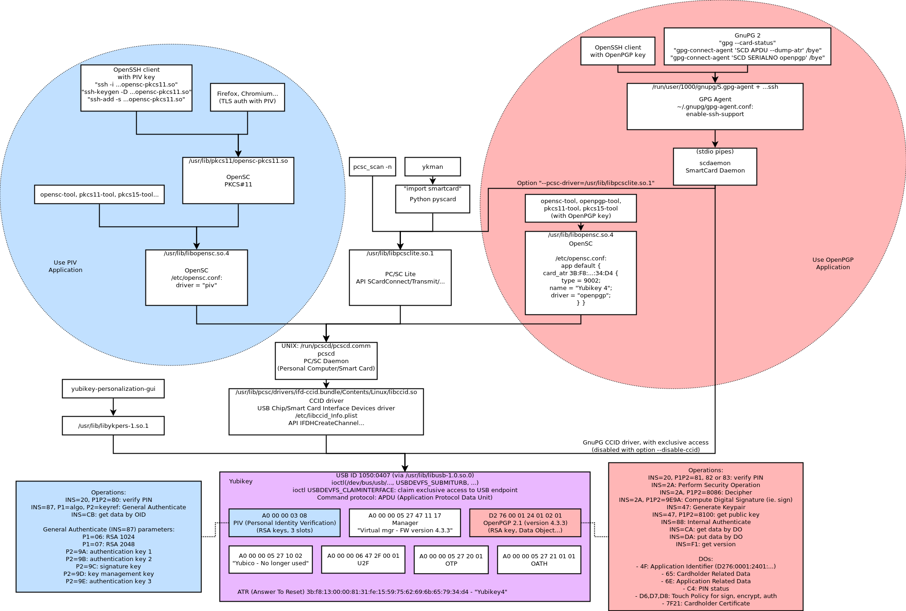

Yubikey 4 on GNU/Linux
======================

This directory contains several information which are useful in order to make Yubikey 4 tokens work on a GNU/Linux system.

Architecture diagram (how components are connected):

Some commands
-------------

.. code-block:: sh

    # Scan for PC/SC tokens
    pcsc_scan

    # Show hardware token ATR (Answer To Reset) and serial number
    opensc-tool --atr
    opensc-tool --serial

    # Show PKCS#11 token information (option -I) and slots (option -L)
    pkcs11-tool --show-info
    pkcs11-tool --list-slots

    # List PKCS#15 certificates
    pkcs15-tool --list-certificates

    # Add OpenSC module to .pki/nssdb database, for Chromium
    modutil -dbdir "sql:$HOME/.pki/nssdb/" -add "opensc" -libfile /usr/lib/pkcs11/opensc-pkcs11.so
    modutil -dbdir "sql:$HOME/.pki/nssdb/" -list

    # Use the PIV certificate from the YubiKey with OpenSC-PKCS#11 library to connect to a SSH server
    ssh -I /usr/lib/pkcs11/opensc-pkcs11.so ssh-server
    ssh -o PKCS11Provider=/usr/lib/pkcs11/opensc-pkcs11.so ssh-server

    # List available SSH keys (with the ones provided by YubiKey's PGP applet too)
    # cf. https://www.linode.com/docs/security/authentication/gpg-key-for-ssh-authentication/
    ssh-add -L
